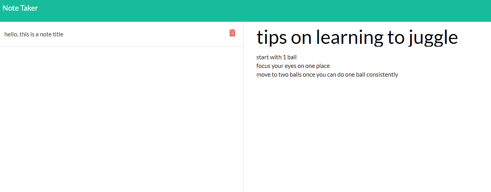

# Note-Taker

## Description
This application allows users to take notes, save those notes and delete notes. It uses heroku and node express to handle server side post and get requests.

## Built With

* [HTML](https://developer.mozilla.org/en-US/docs/Web/HTML)
* [CSS](https://developer.mozilla.org/en-US/docs/Web/CSS)
* [Git]
* [Github](https://github.com/)
* [Javascript](https://www.javascript.com/)
* [Node](https://nodejs.org/en/)
* [Express](https://expressjs.com/)
* [Heroku](https://signup.heroku.com/)


## Deployed Link

* [See Live Site](https://protected-escarpment-29397.herokuapp.com/)

## Preview of Working Site




## Code Snippet
This code snippet shows the epxress listener for deletion of notes from the file. It takes in the parameter for the note to delete, then removes that from the array in the javascript and then rewrites to the database and reassigns all the ids based on the notes' place in the array.

```javascript
app.delete("/api/notes/:id", function (req, res) {
    var id = parseInt(req.params.id);
    noteArray.splice(id, 1);
    console.log(id);
    
    for (var i = 0; i < noteArray.length; i++) {
        noteArray[i].id = i;
    }

    fs.writeFile("./db/db.json", JSON.stringify(noteArray), function(err){
        if (err) throw err;
        res.json(req.body);
    });
})
```

## Authors

* **Raffi Lepejian** 

## Contact Information

- [Link to Portfolio Site](https://rslepejian.github.io/portfolio/)
- [Link to Github](https://github.com/rslepejian)
- [Link to LinkedIn](https://linkedin.com/in/raffi-lepejian-071876153)